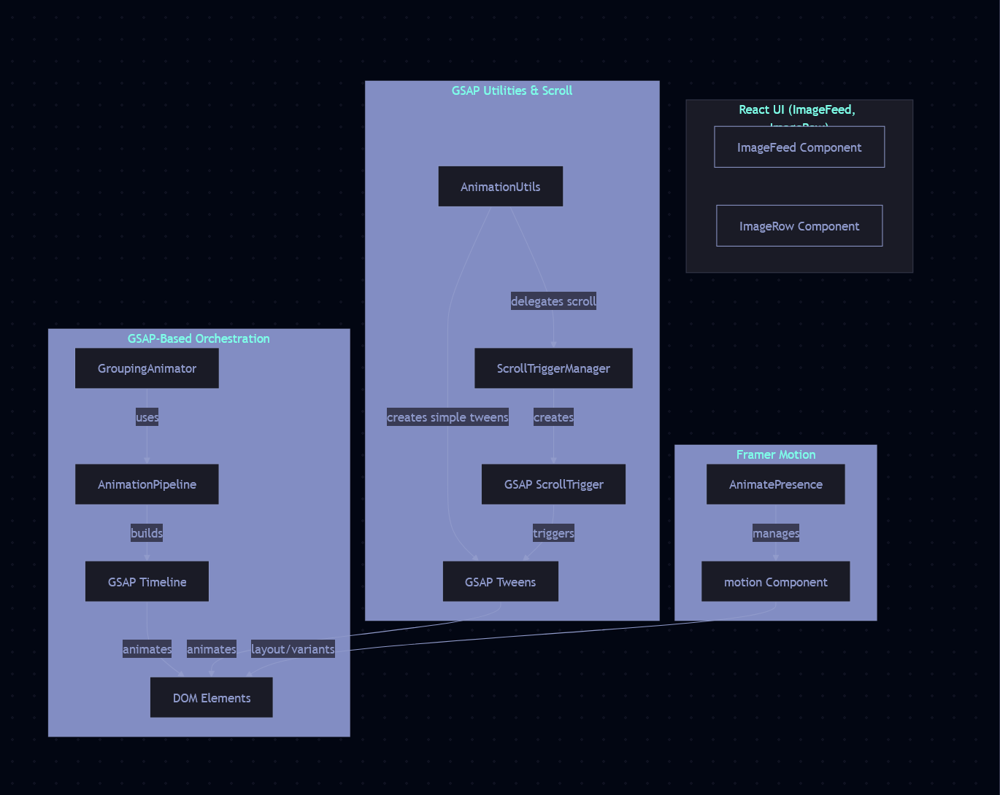

# MediaFlow

<div align="center">
  

  <p><strong>A flexible, high-performance gallery for browsing and managing images, with special support for LoRA model previews</strong></p>

  <p>
    
    
    
    
  </p>
</div>

## ✨ Overview

MediaFlow is a versatile web application designed as a general-purpose gallery for browsing, organizing, and previewing images of any kind. It also offers specialized handling for LoRA (Low-Rank Adaptation) AI model previews, making it ideal for AI artists working with custom model files.

<div align="center">
  
</div>

## 🚀 Key Features

- **General Image Gallery**: Manage and display collections of photos, artwork, screenshots, and more.
- **LoRA Preview Support**: Cleans and processes LoRA preview images (e.g., `.example.x` files) for accurate display.
- **Multiple View Modes**: Grid, Banner, Masonry, Carousel, and Grouped layouts.
- **Advanced Animations**: Smooth transitions and interactions powered by GSAP and Framer Motion.
- **High Performance**: SSR-enabled with Vite, lazy loading, and efficient caching strategies.
- **Client-Side Cache**: IndexedDB for quick repeat visits.
- **Search & Navigation**: Full-text search, hierarchical folder navigation, and cursor-based pagination.
- **Extensible Architecture**: Modular React components, custom hooks, and Web Worker support.

<div align="center">
  
</div>

## 🛠️ Tech Stack

### Frontend

- React 18 + TypeScript
- Vite for development & SSR
- SCSS Modules + Tailwind CSS
- GSAP + Framer Motion
- React Query
- IndexedDB Cache

### Backend

- Express.js (Vite SSR middleware)
- Sharp for image processing
- LRU for server-side caching
- Zod for request validation
- TypeScript

## 🏁 Getting Started

### Prerequisites

- Node.js >= 18
- npm >= 9
- A directory containing your images or LoRA model files

### Installation

```bash
git clone https://github.com/yourusername/mediaflow.git
cd mediaflow
npm install
```

### Configuration

Create a `.env` file in the root:

```env
VITE_PORT=3001
VITE_HOST=localhost
MAIN_DIRECTORY=/path/to/your/image/directory
```

### Running Locally

```bash
npm run dev
# Open http://localhost:3001
```

### Production

```bash
npm run build
npm start
```

## 📖 Usage

1. Browse your image collection via the sidebar.
2. Switch between different view layouts.
3. Search and filter by filename or metadata.
4. Click an image for full-size preview and details.
5. (If using LoRA models) LoRA previews will be auto-cleaned and displayed correctly.

## 🌟 Animation System

MediaFlow uses a unified animation pipeline for sophisticated sequences:

```ts
import { AnimationPipeline } from './src/animations/AnimationPipeline';

const pipeline = new AnimationPipeline();
pipeline
  .addStep({ target: element, preset: 'fadeIn', vars: { duration: 0.5 } })
  .addStep({ target: otherEl, preset: 'slideUp', position: '+=0.1' })
  .play();
```

<div align="center">
  
</div>

## 📂 Project Structure

- `src/`
  - `animations/` – Animation pipeline & presets
  - `components/` – Reusable React components
  - `contexts/` – React Context providers
  - `hooks/` – Custom React hooks
  - `lib/` – Utility modules (caching, API clients)
  - `pages/` – Application views
  - `server/` – Server-side code & API routes
  - `styles/` – SCSS modules & Tailwind CSS
  - `workers/` – Web Worker scripts
- `public/` – Static assets
- `docs/` – Documentation & placeholder images

## 🤝 Contributing

Contributions welcome! Please open issues or pull requests to improve MediaFlow.

## 📄 License

MIT © minipuft

## 🙏 Acknowledgements

- [GSAP](https://greensock.com/gsap/)

## 🔜 Roadmap / TODO for LoRaFinder

- Integrate Zod schemas into Express API endpoints and client-side form validation for safety and type correctness.
- Scrolling animations with our new `AnimationPipeline` (hybrid GSAP timeline + Framer Motion `motion.div` transitions); revisit the docs for guidance.
- Smooth zooming animations for image previews and group transitions.
- Pinch-to-zoom support and gesture handling on touch devices.
- Scroll-triggered animations leveraging `ScrollTriggerManager`.
- Write unit and integration tests for Zod validations and animation pipelines.
- Update documentation and examples for animation usage in the `docs/` directory.
